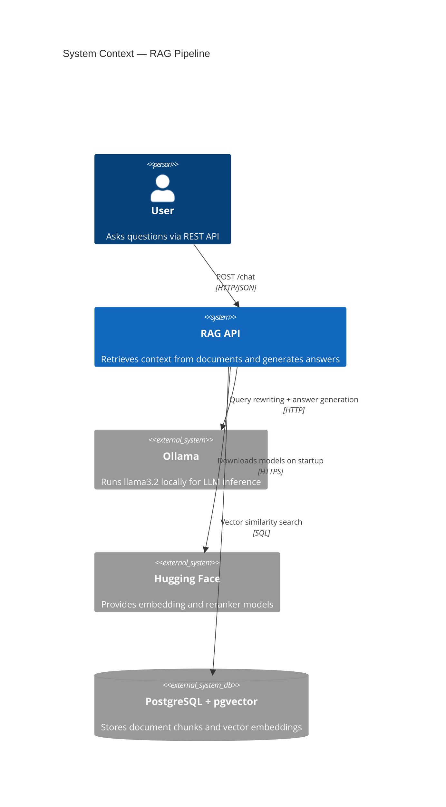
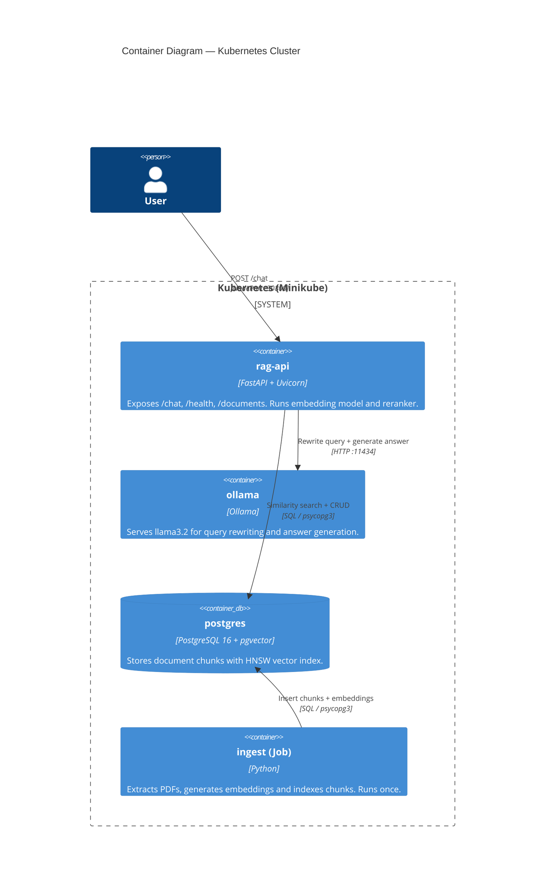
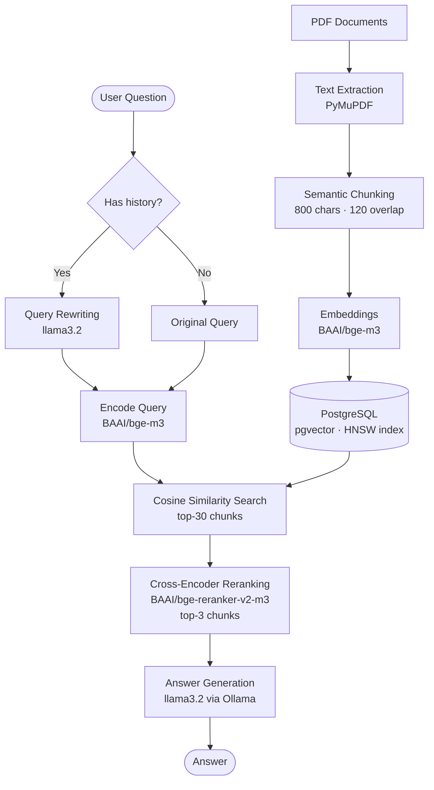

cat > /mnt/user-data/outputs/README.md << 'ENDOFFILE'
# rag-pgvector

A production-ready Retrieval-Augmented Generation (RAG) system. Ingests PDF documents into a PostgreSQL vector database and exposes a REST API for conversational Q&A — fully containerized with Docker and orchestrated with Kubernetes.

---

## System Context



---

## Container Diagram



---

## RAG Pipeline



---

## Tech Stack

| Layer | Technology |
|---|---|
| Embeddings | `BAAI/bge-m3` (local, multilingual) |
| Reranker | `BAAI/bge-reranker-v2-m3` (Cross-Encoder) |
| LLM | `llama3.2` via Ollama |
| Vector DB | PostgreSQL 16 + pgvector (HNSW index) |
| API | FastAPI + Uvicorn |
| ORM | SQLAlchemy 2.0 + psycopg3 |
| Packaging | uv |
| Containers | Docker |
| Orchestration | Kubernetes (Minikube) |

---

## Project Structure

```
├── ingest.py                   # PDF ingestion entrypoint
├── rag.py                      # Terminal chat entrypoint
├── src/
│   ├── models/
│   │   └── embeddings.py       # load_model(), generate_embeddings()
│   ├── persistence/
│   │   ├── schema.py           # ORM — DocumentChunk
│   │   ├── engine.py           # build_engine(), initialize_database()
│   │   └── chunks.py           # load_pdfs(), index_chunks(), create_hnsw_index()
│   ├── retrieval/
│   │   ├── search.py           # cosine similarity search (pgvector)
│   │   ├── reranker.py         # cross-encoder reranking
│   │   └── query.py            # query rewriting with conversation context
│   ├── generation/
│   │   └── llm.py              # answer generation via Ollama
│   ├── chat/
│   │   ├── history.py          # ConversationHistory (per-session)
│   │   └── loop.py             # terminal chat loop
│   ├── api/
│   │   ├── main.py             # FastAPI app
│   │   ├── schemas.py          # Pydantic request/response models
│   │   └── session.py          # SessionManager (in-memory, thread-safe)
│   └── utils/
│       └── constants.py        # shared configuration constants
├── .docker/
│   ├── Dockerfile.ingest
│   ├── Dockerfile.rag
│   ├── Dockerfile.api
│   └── docker-compose.yml
└── k8s/
    ├── secret.yaml
    ├── configmap.yaml
    ├── postgres.yaml
    ├── ollama.yaml
    ├── ingest.yaml
    └── rag-api.yaml
```

---

## Getting Started

### Prerequisites

- [Docker Desktop](https://www.docker.com/products/docker-desktop/)
- [uv](https://docs.astral.sh/uv/)
- [Ollama](https://ollama.com/download)
- [Minikube](https://minikube.sigs.k8s.io/docs/start/) *(for Kubernetes)*
- [kubectl](https://kubernetes.io/docs/tasks/tools/) *(for Kubernetes)*
- NVIDIA GPU *(optional, recommended)*

### 1. Configure environment

```bash
cp .env.example .env
# edit .env with your settings
```

### 2. Run with Docker Compose

```bash
# Start Postgres and Ollama
docker compose -f .docker/docker-compose.yml --env-file .env up postgres ollama -d

# Pull the LLM model
docker compose -f .docker/docker-compose.yml --env-file .env run ollama-pull

# Ingest PDFs
docker compose -f .docker/docker-compose.yml --env-file .env run ingest

# Start the API
docker compose -f .docker/docker-compose.yml --env-file .env up rag-api
```

### 3. Run with Kubernetes (Minikube)

```bash
# Start cluster
minikube start --driver=docker --memory=14000

# Load local images
minikube image load docker-ingest:latest
minikube image load docker-rag-api:latest

# Apply manifests
kubectl apply -f k8s/secret.yaml
kubectl apply -f k8s/configmap.yaml
kubectl apply -f k8s/postgres.yaml
kubectl wait --for=condition=ready pod -l app=postgres --timeout=60s
kubectl apply -f k8s/ollama.yaml
kubectl apply -f k8s/rag-api.yaml

# Copy PDFs and run ingestion via port-forward
minikube ssh "sudo mkdir -p /data/pdfs"
minikube cp ./pdf_folder/<file>.pdf /data/pdfs/<file>.pdf

# Terminal 1
kubectl port-forward svc/postgres 5433:5432

# Terminal 2
uv run python ingest.py \
  --pdf-folder-location ./pdf_folder \
  --db-host localhost --db-port 5433 \
  --db-name rag_db --db-user postgres --db-password postgres

# Expose API
minikube service rag-api --url
```

---

## API Reference

### `GET /health`

```json
{"status": "ok", "database": "healthy"}
```

### `GET /documents`

```json
[{"source": "document.pdf", "chunk_count": 312}]
```

### `POST /chat`

```bash
curl -X POST http://localhost:8000/chat \
  -H "Content-Type: application/json" \
  -d '{"session_id": "user1", "question": "What is logistic regression?"}'
```

```json
{
  "session_id": "user1",
  "question": "What is logistic regression?",
  "answer": "Logistic regression is a discriminative classification model..."
}
```

Interactive docs: `http://localhost:8000/docs`
ENDOFFILE